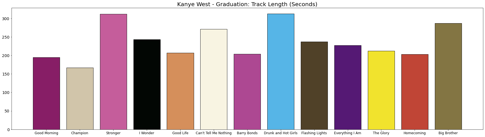
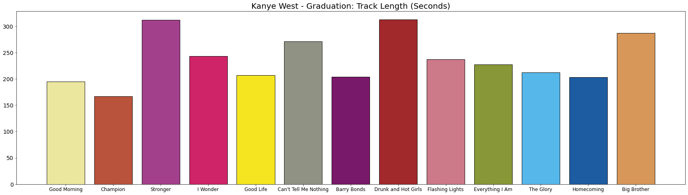

# image2colorpalette
A Python package/tool that allows a user to extract a color palette from a given image. 

After the user selects the number of colors they'd like inside their palette, the program runs a clustering algorithm to automatically generate one. It can be used for graphic design projects, analytics visualizations, etc.

These are the libraries that we will be dependent on to get this to work:

``` python
import numpy as np
import cv2
import matplotlib
import matplotlib.pyplot as plt
import pandas as pd
from sklearn.cluster import KMeans

%matplotlib inline
```

After we `import image2colorpalette`, we need to use OpenCV to select an image from a directory and then convert it to RGB. In our example, we will be using Kanye West's _Graduation_ album cover.


Once the image is in RGB format, we can insert it into the `image2colorpalette()` function and store it as a variable.. The default `palette_size` is 10, but we are going to extract 30 colors. Higher resolution images and the large palette sizes can definitely affect performance and potentially increase run-time.

``` python
import image2colorpalette

# Select image with OpenCV, which is formatted in BGR
graduation_bgr = cv2.imread('../DATA/kanye_graduation_cover.png')

# Convert to RGB
graduation_rgb = cv2.cvtColor(graduation_bgr, cv2.COLOR_BGR2RGB)

# Generate color palette
graduation_palette = image2colorpalette(graduation_rgb, palette_size=30)
```

**Print a preview of the palette, RGB, and HEX codes:**
``` python
graduation_palette.show_palette()
```


**Return a nested array of RGB codes:**
``` python
graduation_palette.get_rgb()
```
``` python
# Output
array([[ 86,  59,  33],
       [181,  79, 151],
       [251, 248, 233],
       [ 83,  25, 116],
       [214, 143,  87],
       [206,  37, 104],
       [199,  93, 159],
       [ 86, 183, 234],
       [ 28,  28,  31],
       [146, 148, 134],
       [245, 231,  31],
       [132,  96,  52],
       [232,  55,   5],
       [  2,   5,   3],
       [197, 190, 183],
       [164,  37,  93],
       [ 30,  91, 160],
       [239, 232, 209],
       [121,  25, 105],
       [222, 161, 124],
       [ 83, 108,  78],
       [173,  57,  53],
       [162,  64, 140],
       [197, 104,  67],
       [102,  43, 132],
       [205, 121, 139],
       [135, 149,  56],
       [236, 231, 159],
       [ 28,  37, 101],
       [203, 186,  59]], dtype=int64)
```

**Return an array of HEX codes:**
``` python
graduation_palette.get_hex()
```
``` python
# Output
array(['#563b21', '#b54f97', '#fbf8e9', '#531974', '#d68f57', '#ce2568',
       '#c75d9f', '#56b7ea', '#1c1c1f', '#929486', '#f5e71f', '#846034',
       '#e83705', '#020503', '#c5beb7', '#a4255d', '#1e5ba0', '#efe8d1',
       '#791969', '#dea17c', '#536c4e', '#ad3935', '#a2408c', '#c56843',
       '#662b84', '#cd798b', '#879538', '#ece79f', '#1c2565', '#cbba3b'],
      dtype='<U7')
```

**Use the palette in visualizations:**
``` python
# Dataset of track names and length (seconds) of each song on Kanye's album.

track_names = ['Good Morning',
               'Champion',
               'Stronger',
               'I Wonder',
               'Good Life',
               'Can\'t Tell Me Nothing',
               'Barry Bonds',
               'Drunk and Hot Girls',
               'Flashing Lights',
               'Everything I Am',
               'The Glory',
               'Homecoming',
               'Big Brother'
               ]

track_length = [195,
                167,
                312,
                243,
                207,
                271,
                204,
                313,
                237,
                227,
                212,
                203,
                287         
                ]
```
_Method 1: Set palette size to 13 and use only the colors from the output._
``` python
# Extract color palette
graduation_palette = image2colorpalette(graduation_rgb, palette_size=13)

plt.figure(figsize=(30,8))

plt.bar(track_names,
        track_length, 
        color=graduation_palette.get_hex(),
        edgecolor='black')
plt.title('Kanye West - Graduation: Track Length (Seconds)', size=20)
plt.xticks(size=12)
plt.yticks(size=14)
```


Since the cluster/palette size of the image was smaller than the previous run example with 30, our variety of colors get reduced and the most dominant colors of the image get selected.

Let's try another method by using the 30 colors palette but randomly selection 13 of them. We can keep running the next chunk to generate new random combinations until we settle on one we like.

_Method 2: Set palette size to 30 and randomly select 13 of them._
``` python
# Extract color palette
import random

graduation_palette = image2colorpalette(graduation_rgb, palette_size=30)

plt.figure(figsize=(30,8))

plt.bar(track_names,
        track_length, 
        color=random.sample(list(graduation_palette.get_hex()),len(track_names)),
        edgecolor='black')
plt.title('Kanye West - Graduation: Track Length (Seconds)', size=20)
plt.xticks(size=12)
plt.yticks(size=14)
```


IF you want to use the palette in Seaborn instead of Matplotlib, you can just use the `get_hex()` function inside the `palette` parameter within Seaborn's plotting functions just like how we used it above in Matplotlib's `color` parameter within the bar plot function.
